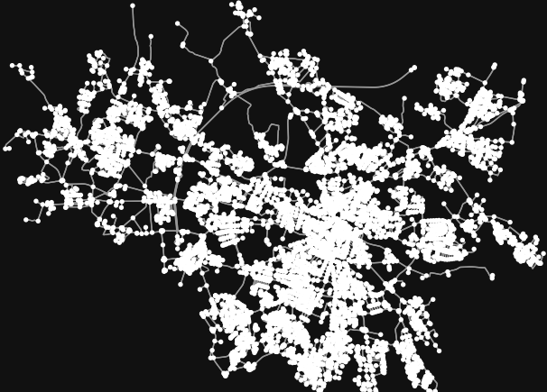
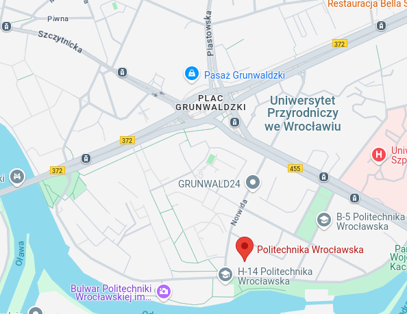

# Project Screenshots

### 1. Wrocław Drive Map

The graph of all driving streets in the city of Wroclaw. Each node represents a connection point of two streets. 

---

### 2. PWr Drive Map  

Part of the driving streets graph cenetered at the Wroclaw University of Science and Technology

### 3. Google PWr Map  

And the same fragment from Google Maps for comparison

---

### 4. PWr Walk Map  

WUST fragment on the graph showing all pedestrian paths.

---

### 5. Simple Pathfinding: A1 to E1  

Shortest path between A1 and E1 building of WUST for the walking pedestrian. 

---

### 6. Graph Size Reduction #1  

Visualisation of different sized circles centered at the Wroclaw Town Square

---

### 7. Graph Size Reduction #2  

Pedestrain streets graph cropped to the 3 000m radius circle from the Town Square

### 8. Map with buildings added

### 9. Familiar PWr region with buildings

